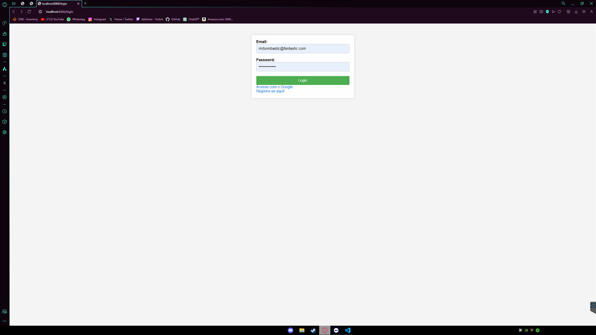
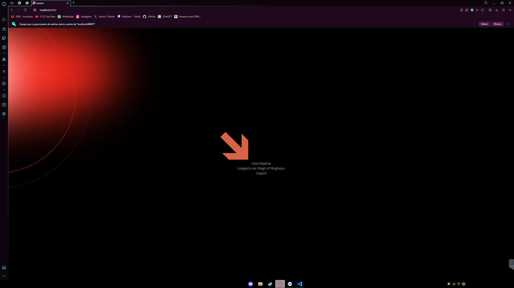
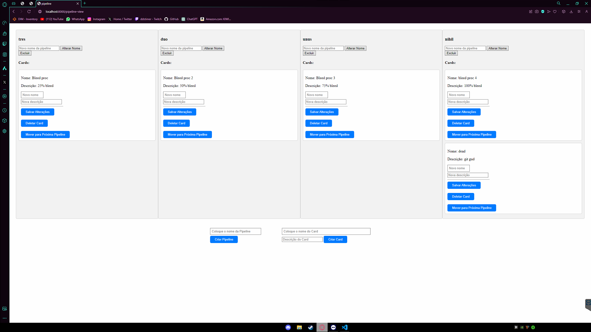
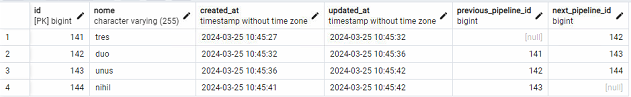
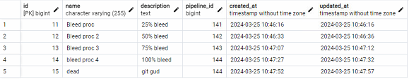

## Projeto prático back-end

Este projeto foi desenvolvido com o intuito habilidades básicas com php/laravel + Eloquent, banco de dados.

desenvolvido nele um pipeline em forma de linha de tempo com o controle de cards.

## preparando o projeto

instalar as dependencias do ambiente de execução.
- **[postgresql](https://www.postgresql.org/download/)**
- **[composer](https://getcomposer.org/download/)**
- **[php](https://www.php.net/downloads.php)**

gere um novo arquivo .env ou renomear o env.example

ajustar o .env de acordo com a instalação de sua database postgresql utilizei ao gerar o projeto:

após a clonagem do git e configuração do .env rodar o projeto utilizando os comandos 
- composer install - para que o composer instale as dependencias
- php artisan migrate - para que o artisan migre as informações da base postgresql
- php artisan key:generate - para que seja gerada a chave unica do da aplicação.

para um "ease of use" deixei um arquivo .bat "prepare.bat" junto ao projeto que vai executar os 3 comandos.

DB_DATABASE=teste-backend

DB_USERNAME=postgres

DB_PASSWORD=Encore123

## funcionamento do login/register usando o auth2 "google api"

utilizando o cadastro/ login via google depende da hash secret da google api e como o git esta publico e o hash seria um dado sensivel e esta censurada no .env. seria necessario a geração de uma nova hash pelo [painel de controle](https://console.cloud.google.com) dos apis da google e informado no .env do projeto, mas caso necessario só pedir que fornecerei o que utilizei no projeto.

- GOOGLE_CLIENT_ID="id client do painel do google"
- GOOGLE_CLIENT_SECRET="codigo de segredo do painel do google"
- GOOGLE_REDIRECT=http://localhost:8000/google/callback

## rodando o Projeto

após as configurações do .env

rodar o seguinte codigo no terminal ou rode o start.bat ou efetue um processo para executar como um serviço (pm2 por exemplo

- php artisan serve

## acesso e utilização 
acesse
http://localhost:8000/login ao acessar faça login ou selecione a opção de registro.

## acesse a view Pipeline

## aqui fica o controle dos pipelines e views

##

##
